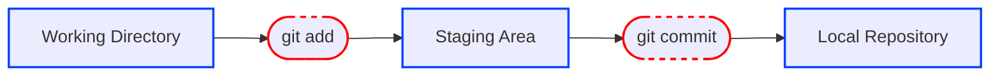

# 03 - Manejo de un Repositorios Git

Esta sección de la guía está pensada para quienes están aprendiendo Git desde cero. Aquí aprenderás qué es un repositorio, cómo se crea, las áreas internas que maneja Git, y cómo clonar proyectos para trabajar localmente.

---

## ¿Qué es un repositorio de Git?

Un **repositorio** es donde Git guarda todo el historial de versiones de un proyecto. Es una carpeta especial que contiene una subcarpeta oculta llamada `.git`.

---

### Áreas internas de Git

Git organiza los cambios en tres áreas:

1. Área de trabajo (Working Directory) : 
 Donde editas, creas o eliminas archivos.

2. Área de preparación (Staging Area) :
   Donde seleccionas qué cambios quieres guardar.

3. Repositorio local (Local Repository) :  
   Donde Git almacena los cambios como "snapshots" o versiones (commits).

Visualmente:



---

## Repositorio local vs remoto

- **Local**: está en tu computador.
- **Remoto**: está en la nube (GitHub, GitLab, etc.) y permite colaborar con otros.

---

## Crear un repositorio desde cero
 Los comandos y ejemplos de esta guía están basados en el sistema operativo Windows, por lo tanto, algunas instrucciones pueden variar ligeramente si estás usando macOS o Linux.

1. Abre la terminal en la carpeta donde quieres iniciar el proyecto.
   ```bash
   cd carpeta
   ```

2. Inicializa un repositorio Git en la carpeta actual

   ```bash
   git init
  
   # Initialized empty Git repository in C:/ruta/.git/ 
   ```
   Muestra el listado completo de archivos y carpetas, incluidas las ocultas (por ejemplo, la carpeta .git).

   ```bash
   dir /a
   ```

3. Crea el repositorio en GitHub (deja todo vacío).
4. Enlaza tu repositorio local con el remoto:

   ```bash
   git remote add origin https://github.com/tuusuario/tu-repo.git
   ```

---

## Clonar un repositorio

**Clonar** es descargar una copia de un proyecto que está en GitHub a tu computador. Es el primer paso para estudiar o contribuir en un proyecto ya existente.

### Pasos para clonar

1. Entra al repositorio en GitHub.
2. Haz clic en el botón azul [<> Code](https://github.com/mxmolano/Git-GitHub) y copia la URL.
3. Abre la terminal donde quieres guardar el proyecto.
4. Escribe:

   ```bash
      git clone https://github.com/usuario/repositorio.git
   ```

   Esto creará una carpeta con el proyecto descargado.

---

## Sincronizar cambios

### Enviar cambios a GitHub (push)

Después de editar y guardar tus cambios con `add` y `commit`, usa:

```bash
git push origin main
```

> Esto actualiza el repositorio remoto.

---

### Obtener cambios del repositorio remoto (pull)

Para traer los últimos cambios de GitHub a tu computador:

```bash
git pull origin main
```

> Haz esto antes de comenzar a trabajar para evitar conflictos.

---

## 💡 Buenas prácticas

- 📁 Asegúrate de estar en la carpeta correcta antes de clonar.
- 💾 Instala Git desde [git-scm.com](https://git-scm.com).
- 🔐 Si GitHub te pide autenticación, usa un **token personal** (PAT) en lugar de tu contraseña.
- 🔁 Ejecuta `git pull` frecuentemente para estar sincronizado con los demás.

---

> 🧠 Esta guía fue escrita mientras yo misma aprendía Git y GitHub. Es una forma de organizar mis notas y compartirlas con otros que también están empezando. Está pensada para que sea clara, progresiva y útil para estudiantes y autodidactas.

